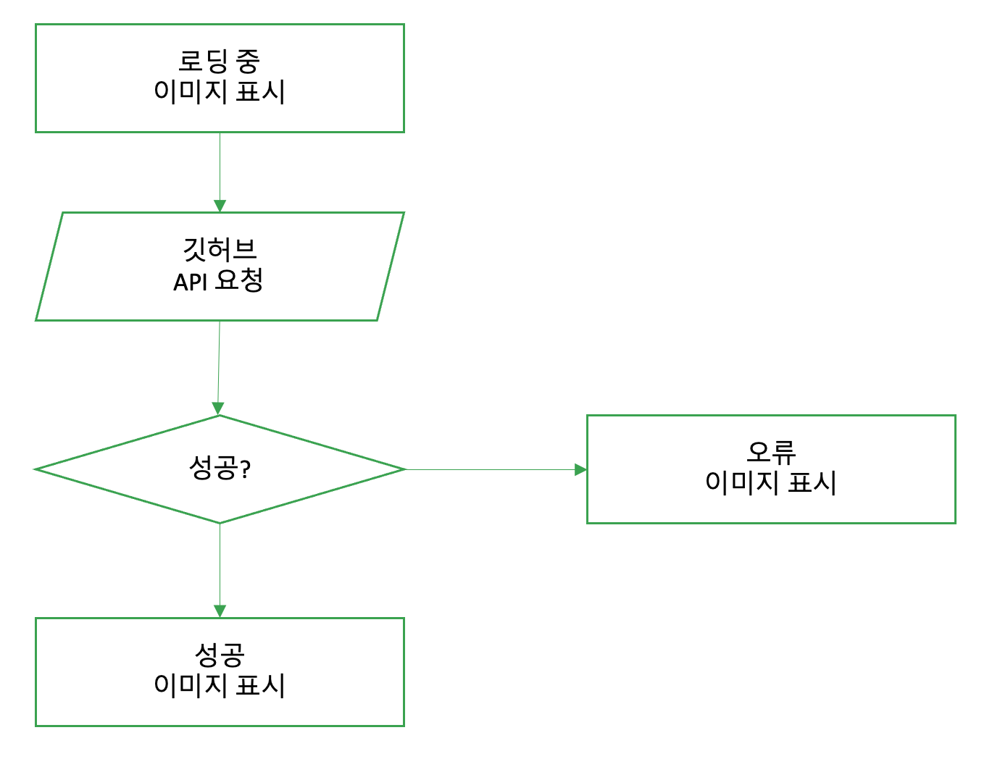

# 웹 구성 요소

[사용자 정의 구성요소 - javascript.info](https://ko.javascript.info/custom-elements)

- 상단 링크에 관련 내용이 책보다 더 자세하게, 쉽게 설명되어 있습니다!

## 📌 서론

- 컴포넌트를 기반으로 하는 웹 개발이 요즘 유행
- 해당 과정에서는, 구성 요소 레지스트리를 활용하였었음
- 최신 브라우저에서는 Component 관련 네이티브 API세트를 사용하여 구성 요소를 사용할 수 있음

## 📌 개념

### ➡️ API

- HTML 템플릿: `<template>` 태그는 렌더링 되지는 않지만, <br />
  동적인 컨텐츠를 생성하는 데, `스탬프`로 사용될 수 있음
- 사용자 정의 요소: 자신만의 DOM 요소를 작성할 수 있음 <br />
- 쉐도우 DOM: 외부의 DOM에 영향을 받지 않아야하는 경우에 유용하게 사용가능. <br />
  다른 사람들과 공유할 수 있도록 구성 요소 라이므러리나 위젯을 개발하는데 유용

### ➡️ 쉐도우 DOM

- 쉐도우 DOM과 가상 DOM의 존재 목적은 각각 다름
  - 쉐도우 DOM은 캡슐화와 관련되어 있음 <br />
    [쉐도우 돔 - toast.com](https://ui.toast.com/posts/ko_20170721)
  - 가상 DOM은 성능과 관련되어 있음

### ➡️ 사용자 정의 요소

- 사용자 정의 태그를 사용할 때에는, 대시로 구분된 두 단어 이상의 태그를 사용해야 함
- 쉽게 접근하자면, 사용자 정의 요소는 "HTML요소를 확장하는 자바스크립트 클래스 일 뿐임.

### ➡️ [예시] 쉐도우 DOM + 사용자 정의 요소

```javascript
// 사용자 정의 요소를 만듦
// 해당 요소에는 라이프 사이클 콜백들이 선언되어 있음
class MyElement extends HTMLElement {
    static get observedAttributes() {return ['lang']; }

    constructor() {
      super();

      // add shadow root in constructor
      const shadowRoot = this.attachShadow({mode: 'open'});
      shadowRoot.innerHTML = `
        <style>div { background-color: #82b74b; }</style>
        <div>yey</div>
      `;
      this._yey = shadowRoot.querySelector('div');
    }

    attributeChangedCallback(attr, oldValue, newValue) {
      if (attr == 'lang') {
        let yey;
        switch (newValue) {
          case 'ko':
            yey = '만세!';
          break;
          case 'es':
            yey = 'hoora!';
          break;
          case 'jp';
            yey = '万歳!';
          break;
          default:
            yey = 'yey!';
        }

        this._yey.innerText = yey;
      }
    }

    yell() {
      alert(this._yey.innerText);
    }
  }

  // 위에서 제작한 사용자 정의 구성 요소를 사용하기 위해,
  // 브라우저 구성 요소 레지스트리에 추가해야함.
  window.customElements.define('my-element', MyElement);
```

- 위 사용자 정의 구성 요소는 하기와 같이 사용할 수 있음

```HTML
<body>
  <my-element />
</body>
```

### ➡️ 속성 관리

- 사용자 웹 구성 요소는, 어떤 프레임워크와도 호환 가능한 새로운 구성 요소를 만들 수 있다는 것이 장점
- 사용자 정의 요소에서도 속성을 추가하거나 얻을 수 있는 방법이 있어야겠지?
  - 요소의 속성은 getter와 setter로 구현 가능함!

```javascript
class MyElement extends HTMLElement {
  get color() {
    return this.getAttribute('color') || DEFAULT_COLOR;
  }
  set color(value) {
    this.setAttribute('color', value);
  }
  //...
}
```

- 위에서 구현된 색상관련 게터와 세터는 단순히 기존 API를 사용하는 것 뿐임.<br />
  활용법은 하기와 같음

  ```HTML
    <my-element color="red"></my-element>
  ```

- 단, 문자열이 아닌 다른 값을 전달하기에 어려움이 있음<br />
  객체를 문자열로 변경하여 전달하던지 해야함

- 그리고 만약 다음과 같은 코드로 위 코드를 변경했다고 하면, <br />
  화면에 변화가 일어나지 않는다 <br />
  `요소.color = "balck"` <br />

  > 변화가 없는 이유?
  >
  > In the current implementation of <time-formatted>, after the element is rendered, further attribute changes don’t have any effect. That’s strange for an HTML element. Usually, when we change an attribute, like a.href, we expect the change to be immediately visible. So let’s fix this.
  >
  > -javascript.info

  - 해결책1: set color(){} 를 이용하는 법
  - 해결책2: DOM 의 라이프사이클에서 속성이 변경되도록, <br />
    `attributeChangedCallback` 메서드를 사용하는 것. <br />
    해당 메소드는 속성이 변할 때마다 호출됨.
  - 해결책2 의 코드

```javascript
export default class HelloWorld extends HTMLElement {
  // 변화 요소를 감지할 속성들을 배열로 담아서 던져주셈!
  static get observedAttributes() {
    // return ['datetime', 'year', 'month', 'day', 'hour', 'minute', 'second', 'time-zone-name'];
    return ['color'];
  }

  // observedAttributes의 속성들의 변경되면 호출됨.
  attributeChangedCallback(name, oldValue, newValue) {
    if (!this.div) {
      return;
    }

    if (name === 'color') {
      // 여기서 속성을 변경하면, 자동으로 반영됨
      this.div.style.color = newValue;
    }
  }
  // ...
}
```

## 📌 가상 DOM 통합

- 기존 `02 Rendering`의 diff 알고리즘을 활용하여, <br />
  색상이 변경될 때마다 가상 DOM알고리즘을 호출해 색상을 수정할 수 있음

```javascript
  attributeChangedCallback(name, oldValue, newValue) {
    // 해당 요소가 자식 노드를 가지고 있으면 반영X...?
    // 이러는 이유를 아시는 분...!!
    if (!this.hasChildNodes()) {
      return;
    }

    // 기존 노드와 차이점 분석 후,
    // 가상 돔을 통해 렌더링 진행
    applyDiff(this, this.firstElementChild, createDomElement(newValue));
  }
```

## 📌 Github Avatar W/O 사용자 정의 이벤트



- 사진 상의 로직은 전부 `DOM 요소의 라이프사이클` 에서 작동함
- 관련 코드는 `GitAvatar1` 폴더에 위치함
- 해당 구성 요소는 목적이 하나 뿐 => 구성 요소 외부의 환경에 대응하지 못해<br/>
  ~~무슨 뜻인지 정확히 모르겠음!~~

## 📌 Github Avatar With 사용자 정의 이벤트

[사용자 정의 이벤트 설명 - javascript.info](https://ko.javascript.info/dispatch-events)

- `아바타가 로드됐을 때`와, `오류가 발생했을 때`에 대한 이벤트
- 로드 성공시 이벤트 등록 관련 코드

  ```javascript
  onLoadAvatarComplete() {
    const event = new CustomEvent(AVATAR_LOAD_COMPLETE, {
      detail: {
        avatar: this.url,
      },
    });

    this.dispatchEvent(event);
  }
  ```

- 해당 이벤트 핸들러 코드
  ```javascript
  avatar.addEventListener(EVENTS.AVATAR_LOAD_COMPLETE, (e) => {
    // 해당 이벤트에 대한 인자를 받을 수 있음
    // e: detail: { avatar: this.url }
    console.log('Avatar Loaded', e.detail.avatar);
  });
  ```
  - 위 코드들을 통해서 이미지 로드가 성공했을 때,<br />
    `console.log('Avatar Loaded', e.detail.avatar);` 가 찍힘

# TodoMVC에 사용자 구성 요소 도입

## 📌 구성요소

- todomvc-app
- todomvc-list
- todomvc-footer

## 📌 `<template>` 요소 활용

- `<template>` 요소를 적극적으로 활용함
- 간략 코드

  ```HTML
  <!-- ... -->
  <template id="footer"> ~~ </template>
  <template id="todo-item"> ~~ </template>
  <template id="todo-app">
    <todomvc-list></todomvc-list>
    <todomvc-footer></todomvc-footer>
  </template>
  <todomvc-app></todomvc-app>
  <!-- ... -->
  ```

- 위의 코드와 같이 `<template>` 요소를 통해 컴포넌트를 생성하는 모습을 볼 수 있음
- `components/List` 에서는,<br />
  어떤 Todo 아이템의 삭제 요청인지에 대한 정보를 받아,<br />
  이벤트의 인자로 줘버림.<br />
  => 그래서 실제로 삭제하는 로직은 `요소 외부`에서 처리함<br />
- `components/Application` 에서는 전반적인 이벤트를 관리함
  - 1. todo 요소의 추가
  - 2. todo 요소의 삭제
  - 3. 리스트의 DOM 과 State를 동기화
  - 근데 책에 있는 내용 그대로 하면 에러뜸!ㅎ (this 바인딩 문제라고 함...)

# 사용자 정의 구성 요소(구성요소) VS 렌더링 함수

- `구성요소`를 기반으로 하면 HTML 을 확장해나가면서 작업, 클래스를 기반으로 작업
- `구성요소`를 기반으로 한다면, 휴대성이 좋아야 함.
- `구성요소`가 대부분의 DOM UI를 작성하는 표준 방법이긴 해.

# 마무리

- `구성요소`의 활용으로 여러 도구들이 탄생하고 있음
- `구성요소`을 통한 FW 기본 아이디어는 "기존과 동일한 코드를 작성하는 것"이라고 책에서 말하는데,<br />
  "익숙한 HTML 태그 형태를 가져다가 확장하면 된다는 뜻"인듯!

# 참고자료

- [HTML 요소 및 프로퍼티 - javascript.info](https://ko.javascript.info/dom-attributes-and-properties)
- [사용자 정의 구성요소 - javascript.info](https://ko.javascript.info/custom-elements)
- [사용자 정의 이벤트 설명 - javascript.info](https://ko.javascript.info/dispatch-events)
- [쉐도우 돔의 설명 - toast](https://ui.toast.com/posts/ko_20170721)
